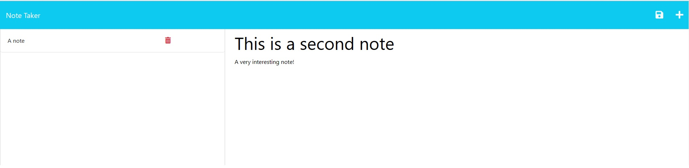

# dynamic-employee-manager

## Description

The motivation behind this project was to practice and clarify concepts and understanding related to the use of expressJS to deploy a nodeJS based application from the backend. This project forced a very rapid understanding of concepts that were only very lightly touched on previously and tested me greatly. Sepcifically, this project required development of skills in the area of nodeJS, ExpressJS, routes and routing, the filter() method, USE, POST, SEND, GET, various fs methods and more. Although the amount of code required may have been smaller the understanding required was significant.

## Table of Contents

- [Description](#description)
- [Usage](#usage)
- [Deployment](#deployment)
- [Credits](#credits)
- [License](#license)

## Installation

If running from integrated terminal remember to run NPM install prior to use.

## Usage

Upon loading the application in Heroku the user will arrive at t a landing page. They will access the main functional section by clicking a link.
The user will be taken to the notes page which will create notes dynamically on the page from a file in the backend.
The user can create more notes by entering a title and content for the note before clicking save. 
The new note will then be appear on the sidebar. The user is also able to delete the notes individually by clicking the trashcan next to the title that will use the note's unique id to delete it.

Screenshot:

## Deployment

The deployed application on Heroku:
(https://arcane-caverns-11310.herokuapp.com/)

## Credits

This project involved the use of starter code.

It also makes use of nodeJS, ExpressJS, fs and Utils. 

Everything else besides this is primarily my own work.

Credit also to my teachers, as without them this would not have been possible.

## License

Licensed under the MIT license.
